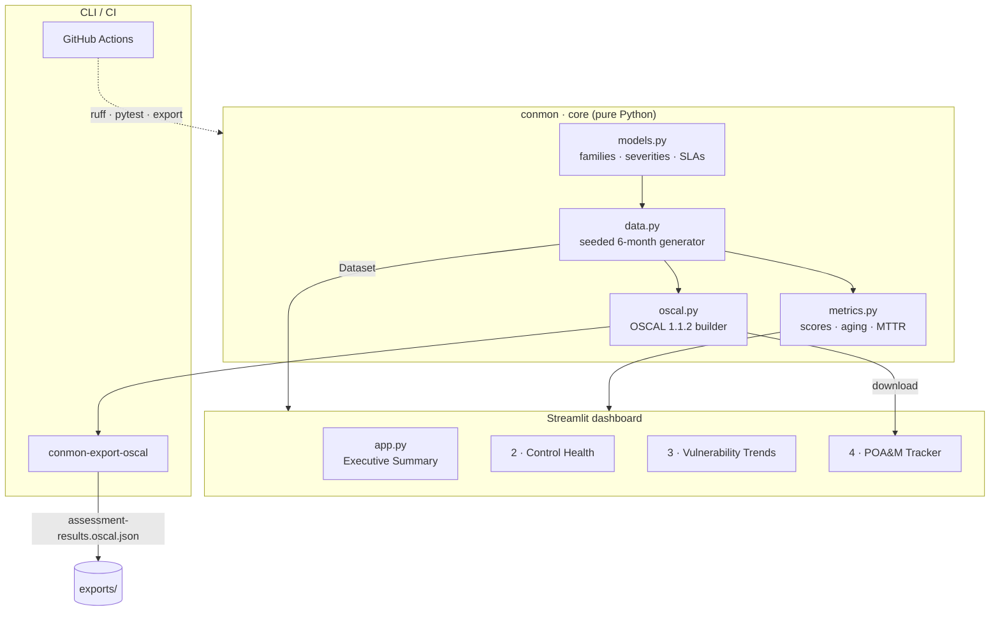
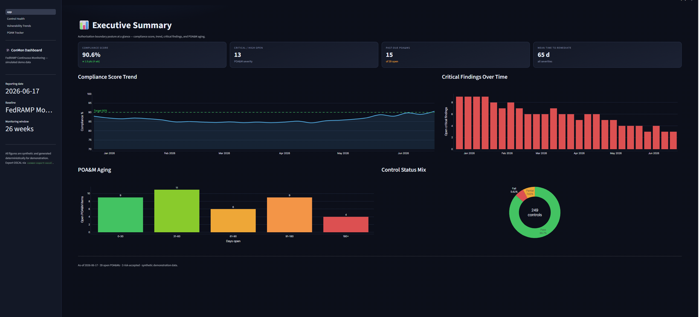
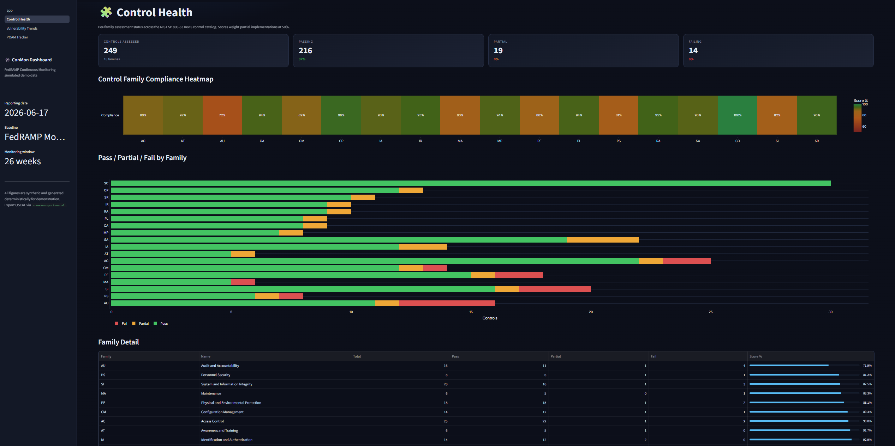
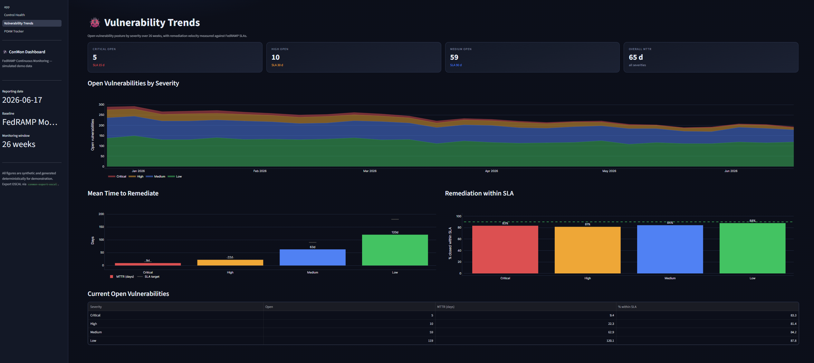
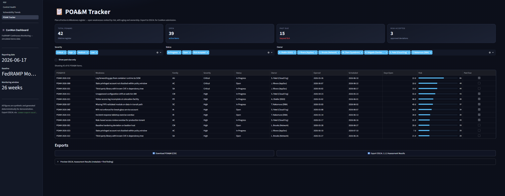

<div align="center">

# 🛰️ Continuous Monitoring Dashboard

**A FedRAMP-style ConMon dashboard that tracks control health, POA&M aging, vulnerability trends, and compliance drift over time.**

[](https://github.com/JulietRodriguez/continuous-monitoring-dashboard/actions/workflows/ci.yml)
[](https://www.python.org/)
[](https://streamlit.io/)
[](https://pages.nist.gov/OSCAL/)
[](https://csrc.nist.gov/pubs/sp/800/53/r5/upd1/final)
[](https://docs.astral.sh/ruff/)
[](LICENSE)

</div>

---

## Overview

`continuous-monitoring-dashboard` simulates a **FedRAMP Continuous Monitoring (ConMon)**
program for a cloud system. It generates a realistic six-month history of control
assessments, vulnerability scans, and Plan of Action & Milestones (POA&M) activity,
then surfaces it through a multi-page **Streamlit** dashboard with a dark SOC/GRC
theme. The same data layer powers a one-command **OSCAL 1.1.2 Assessment Results**
export suitable for ConMon submission tooling.

> ⚠️ **All data is synthetic.** It is generated deterministically for demonstration
> and training — it does not represent any real system or authorization.

## Features

| Area | What it does |
| --- | --- |
| 📊 **Executive Summary** | Overall compliance score, 26-week trend line, critical/high findings, POA&M aging, and control-status mix. |
| 🧩 **Control Health** | Heatmap of all NIST SP 800-53 Rev 5 control families with Pass / Partial / Fail breakdown and per-family scores. |
| 🐞 **Vulnerability Trends** | Stacked severity history (Critical / High / Medium / Low), mean-time-to-remediate, and SLA-compliance against FedRAMP timeframes. |
| 📋 **POA&M Tracker** | Filterable register of open items with days open, risk score, owner, and past-due flags; CSV + OSCAL export. |
| 🗂️ **OSCAL 1.1.2 Export** | Generates a valid OSCAL Assessment Results document (observations, risks, findings) with deterministic UUIDs. |
| 🎛️ **Deterministic data** | Seeded generator → identical visuals and reproducible exports for stable demos and tests. |
| ✅ **Quality gates** | Full `pytest` suite (including headless Streamlit page smoke tests), `ruff` lint + format, GitHub Actions CI. |

## Architecture



The core package (`conmon/`) is **UI-free and fully testable**: `data.py` produces a
single immutable `Dataset`, `metrics.py` derives every KPI from it, and `oscal.py`
turns it into an OSCAL document. The Streamlit pages and the CLI are thin consumers.

## Quick start

```bash
# 1. Install (use a virtual environment)
python -m pip install -r requirements-dev.txt
python -m pip install -e .

# 2. Launch the dashboard
streamlit run app.py

# 3. Export OSCAL 1.1.2 Assessment Results
conmon-export-oscal --out exports/assessment-results.oscal.json
```

The dashboard opens at <http://localhost:8501> with four pages in the sidebar.

### CLI

```text
$ conmon-export-oscal --help
usage: conmon-export-oscal [-h] [--out OUT] [--seed SEED] [--as-of AS_OF]

Export OSCAL 1.1.2 Assessment Results from simulated ConMon data.

options:
  --out, -o OUT    Output JSON path (default: exports/assessment-results.oscal.json).
  --seed, -s SEED  Data generation seed (default: 42).
  --as-of AS_OF    Reporting date YYYY-MM-DD (default: 2026-06-17).
```

## Project layout

```text
continuous-monitoring-dashboard/
├── app.py                       # Page 1 · Executive Summary (Streamlit entry point)
├── pages/
│   ├── 2_Control_Health.py      # Page 2 · NIST 800-53 control-family heatmap
│   ├── 3_Vulnerability_Trends.py# Page 3 · Severity trends + MTTR
│   └── 4_POAM_Tracker.py        # Page 4 · POA&M register + OSCAL export
├── conmon/
│   ├── models.py                # Control families, severities, SLAs, statuses
│   ├── data.py                  # Deterministic 6-month mock-data generator
│   ├── metrics.py               # Compliance score, aging, MTTR, summaries
│   ├── oscal.py                 # OSCAL 1.1.2 Assessment Results builder
│   ├── theme.py                 # Dark SOC/GRC palette + Plotly template
│   ├── dashboard.py             # Shared Streamlit helpers (KPIs, sidebar)
│   └── cli.py                   # `conmon-export-oscal` entry point
├── tests/                       # pytest suite (data, metrics, oscal, cli, app smoke)
├── .github/workflows/ci.yml     # Lint + test matrix + OSCAL export smoke
└── .streamlit/config.toml       # Dark theme defaults
```

## OSCAL export

The export conforms to the [OSCAL 1.1.2 Assessment Results](https://pages.nist.gov/OSCAL/resources/concepts/layer/assessment/assessment-results/)
JSON model:

```jsonc
{
  "assessment-results": {
    "uuid": "…",
    "metadata": { "oscal-version": "1.1.2", "title": "Continuous Monitoring Assessment Results", … },
    "import-ap": { "href": "./assessment-plan.oscal.json" },
    "results": [
      {
        "observations": [ /* one per control family */ ],
        "risks":        [ /* one per POA&M item, with risk-score + severity props */ ],
        "findings":     [ /* link risks ↔ observations ↔ control objectives */ ]
      }
    ]
  }
}
```

UUIDs are derived (UUIDv5) from stable keys, so re-exporting the same dataset is
diff-friendly. You can drop the output into OSCAL-aware tooling (e.g. the NIST OSCAL
CLI or `oscal-cli validate`) for schema validation.

## Testing & quality

```bash
pytest                      # full suite (unit + headless Streamlit smoke tests)
pytest --cov=conmon         # with coverage
ruff check .                # lint
ruff format --check .       # format check
```

CI runs the same gates across Python 3.10 – 3.12 and uploads the generated OSCAL
document as a build artifact.

## Screenshots

> Generate fresh captures by running `streamlit run app.py` and saving images into
> `docs/screenshots/`. Each page is wide-layout and looks best at ≥ 1440px.

### Executive Summary



*Overall compliance score, 26-week trend line, critical findings, and POA&M aging at a glance.*

### Control Health



*NIST SP 800-53 Rev 5 control-family heatmap with Pass / Partial / Fail breakdown.*

### Vulnerability Trends



*Severity history (Critical / High / Medium / Low) with mean-time-to-remediate against FedRAMP SLAs.*

### POA&M Tracker



*Filterable register of open items with days open, risk score, owner, and OSCAL export.*

## Disclaimer

This project is an independent demonstration. It is **not** affiliated with or
endorsed by FedRAMP, NIST, or any U.S. government agency, and the synthetic data it
produces must not be used for an actual authorization or compliance decision.

## License

Released under the [MIT License](LICENSE).
